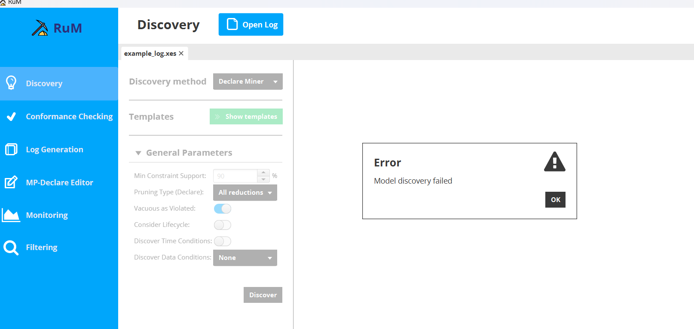
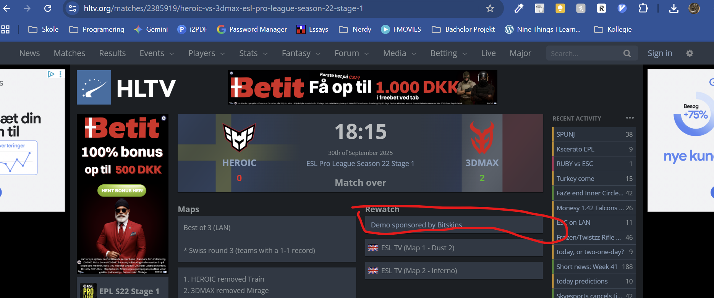
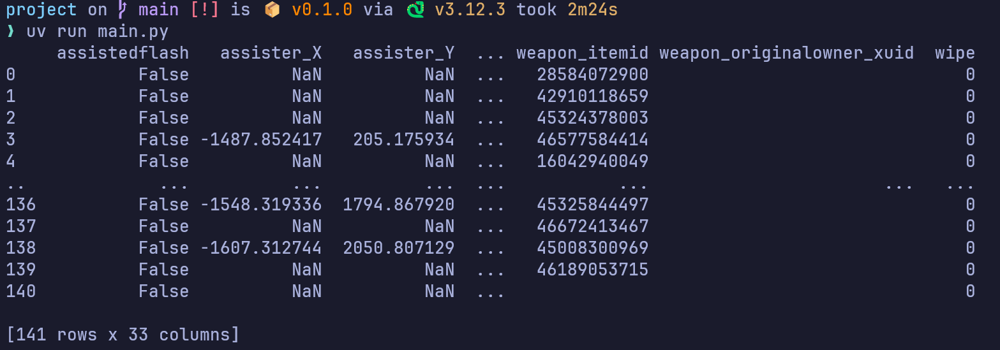

# Goals
**I have manipulated the raw event log to perform certain analyses** ✅  
Quite a lot actually

**I have used and reported on state-of-the-art of available technologies, both commercial products and open source tools** 🟨  
We are all using RUM which is open source. 
We should construct some petri nets using disco, so we also use commercial tools

**I have performed some correct/coherent modelling of a process using a formal language to describe processes (e.g., Petri net)** 🟨  
We are doing this at the moment and have something to show. 

**I have answered domain related questions using the results of process mining** 🟥  

**I have tested, discussed and compared different process mining algorithms in the context of the given problem (e.g., for the discovery, Inductive Miner vs Heuristics Miner)** 🟥  
Note sure if RUM supports this. If it does not, we must talk to Andrea or construct some petri nets using disco.

**I have discussed, interpreted and evaluated the outcomes of the process mining activity** 🟥  
Can be done once we have some actual models

**I have compared different process mining techniques (e.g., discovery, conformance) and discussed which to use to achieve my purposes** 🟥  
We have not compared anything, but most likely conformance does not make sense, since there are no "illegal" ways of playing CSGO. We could, however, compare a the game play of a noob with a pro, and check the conformance

**I have verified the correct behavior (e.g., using the “token game”) of a process represented in a formal language (e.g., Petri net) and investigated some of its basic properties (e.g., deadlock-free, bounded)** 🟥  
Await finished model

# What we focus on
We follow Andre's lead and try to focus on the dynamic behavoir of a match (one round in a game). How does CT react on the actions of T and vice versa. To limit the scope of the assignment, we have decided to only focus on the map: `de_dust2`. We have also focus on some different processes to further limit the scope of a process. 

| Description | Start | Name |
| ------ | --- | - |
| A successful flashbang. A flashbang is considered successful if player A throws a flashbang, enemy player B is flashed, and then player A kills player B within a specific time limit  | When a flashbang is thrown    | When player B dies or after X ticks |
| A team winning a round by ahnialating the enemy team | Round begins | team wins |
| The terrorist that gets the first kill. Analyze his behavoir up untill he kills | When round begins | When first blood is drawn |
| Characterize the process of a specific player, `faker`, that buys an awp and gets his first kill | Round begins |first blood is drawn |

# Ideas for future work
* Look at different games where we keep one team constant. 
    * Look at a game where the pro team plays noobs 
* Characterize the behavoir of a team in a round. A characterization could be something like: "they buy snipers", "they all go bombsite B", "none of them buys equipment". Then only look at the other team, and see how they react based on the simplified representation of opposing team

# Make it work on my machine

## RuM
you need to install java sdk 11 for it to work

download rum here: https://rulemining.org/ 

extract the folder whereever you want, that folder contains the SDK for java install whetever fits your IOS

open that folder in command prompt and run the following command

"C:\Program Files\Java\jdk-11\bin\java.exe" -Djava.library.path=. -jar rum-0.7.2.jar

If you get this, you most likely used the wrong Java to compile it. See the video tutorial on RuM, its good enough to understand it

## How to parse a file

Download the demo file [here](https://www.hltv.org/matches/2385919/heroic-vs-3dmax-esl-pro-league-season-22-stage-1)

We have compiled a collection of Dust2 games featuring Heroic against different opponents.
The files can be found as a Zip archive [here](https://dtudk-my.sharepoint.com/:u:/g/personal/s204152_dtu_dk/EWZ-9RMrr9JFkH3LVwG1LuQBfGzFUzO_d7X534ByVL6m5Q?e=7u4coO). \
**DTU associated account required** \
Or copying this link:   
https://dtudk-my.sharepoint.com/:u:/g/personal/s204152_dtu_dk/EWZ-9RMrr9JFkH3LVwG1LuQBfGzFUzO_d7X534ByVL6m5Q?e=7u4coO

## If you use uv

You can download uv here [uv](https://docs.astral.sh/uv/#installation).

Run `uv sync` to install the necessary dependencies on your system.
To check that everything is working, do: `uv run main.py`. If it looks like the image below, you are ready to code!!

