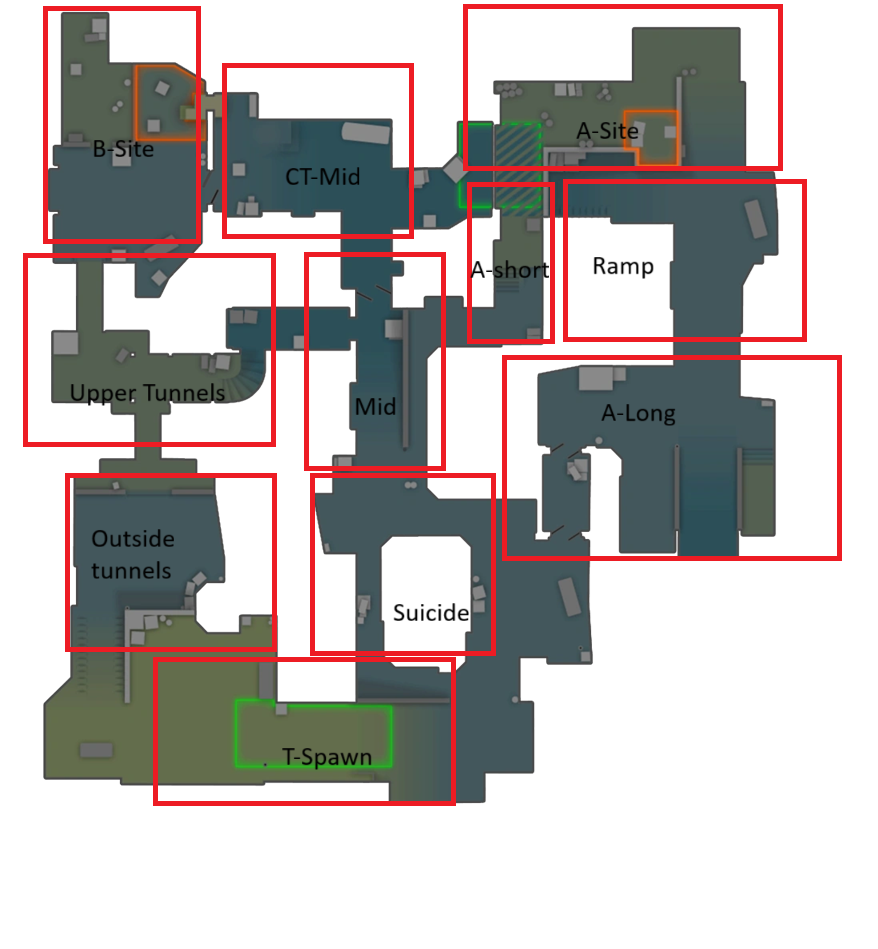

# Make it work on my machine

Download the demo file [here](https://www.hltv.org/matches/2385919/heroic-vs-3dmax-esl-pro-league-season-22-stage-1)


Only consider the `heroic-vs-3dmax-m1-dust2.dem` demo file, and put it in the base of the working tree of the project

## If you use uv

You can download uv here [uv](https://docs.astral.sh/uv/#installation).

Run `uv sync` to install the necessary dependencies on your system.
To check that everything is working, do: `uv run main.py`. If it looks like the image below, you are ready to code!!


# What we focus on

We follow Andre's lead and try to focus on the dynamic behavoir of a match (one round in a game). How does CT react on the actions of T and vice versa. To limit the scope of the assignment, we have decided to only focus on the map: `de_dust2`. We therefore define a case in our process as one particular round.

In our initial MVP, we only focus on two kinds of events:

* When a player dies
* When a player changes zones.

Furthermore, following Andre's recommendation, we have decided to use declarative process mining.

## Zones

We have rudely defined the following zones on the map. The zones are subject to change in the future


# Tasks

Our initial goal is to have a set of scripts that converts the huge dataset we have of a [partiuclar game](https://www.hltv.org/matches/2385919/heroic-vs-3dmax-esl-pro-league-season-22-stage-1), to an xes-log that can be used by the tools shown in class.

Since we will most definetly have to revise our scripts and extend them to include more kinds of events, it is important that we write the code, such that it can be easily extended!

## Mapping Fuction (Morten and Casper)

A mapping function that takes an x- and a y-coordiante and outputs an integer id that corresponds to a zone we defined

```python
def coordinates_to_box(x: int, y: int) -> int
```

## Compressed dataframe (William and Felipe)

We want to compress the dataframe representing the game into a format we can convert into an XES log. The exact structure of the compressed dataframe will probably change, because we do not know what is required to convert the compressed dataframe into an XES log. Coordination between the compressed dataframe builders and the XES log converter creator is necessary
Each entry in the compressed dataframe could contain the following features:

```
tick, event, team
```

Where an event is either describing a player changing zones or a player dying.

## Convert Compressed Dataframe to XES log (Gabriel, Kris)

Given a compressed dataframe as defined in the previous section, create an XES log that is compatible with the tools shown in class. You will most likely have requirements to the form of the compressed dataframe, so it is necessary to coordinate with the compressed dataframe team, so they can create a dataframe you can use

## How to Make RuM run

you need to install java sdk 11 for it to work

download rum here: https://rulemining.org/ 

extract the folder whereever you want, that folder contains the SDK for java install whetever fits your IOS

open that folder in command prompt and run the following command

"C:\Program Files\Java\jdk-11\bin\java.exe" -Djava.library.path=. -jar rum-0.7.2.jar

If you get this, you most likely used the wrong Java to compile it. See the video tutorial on RuM, its good enough to understand it


